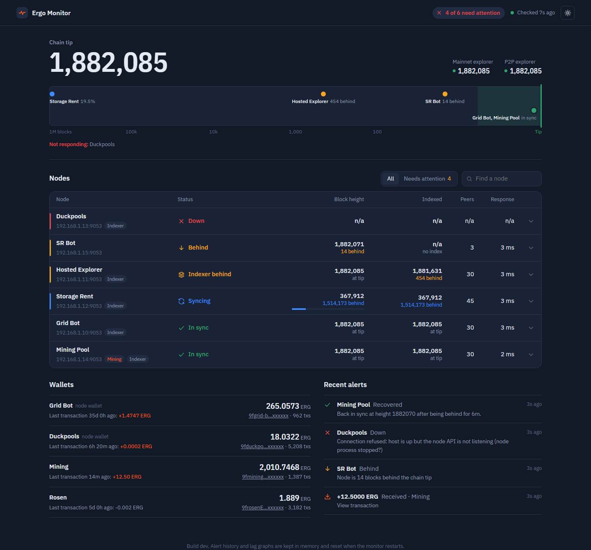

# Ergo Monitor

Watches your Ergo nodes and wallets, shows them on a dark-mode dashboard, and
sends Discord alerts when something needs attention.



- **Nodes**: block height and indexer height compared with the chain tip
  from the mainnet and P2P explorers. Alerts when a node is **down**, more than
  5 blocks **behind**, its **indexer is behind**, or it's **syncing**, and again
  when it **recovers**.
- **Wallets**: balance and incoming transactions for bot/pool wallets and any
  other address.
- **Dashboard** at `http://<host>:7777`, plus a JSON API for scripts and AI
  agents (see [AGENTS.md](AGENTS.md)).
- One Docker container. Everything compiles inside Docker, so you don't need
  Rust installed.

## Quick start

```powershell
git clone https://github.com/2ndtlmining/Ergo_Discord_Notifications.git
cd Ergo_Discord_Notifications
copy .env.example .env        # then edit .env (see below)
scripts/deploy.ps1            # or: docker compose up -d --build
```

Open **http://localhost:7777**. Discord receives a startup summary within 30 seconds.

On Linux/macOS, use `cp .env.example .env` and `docker compose up -d --build`.

## Where your node IPs and wallets go: `.env`

All settings live in `.env` in the project folder. It is **never committed**
(it's in `.gitignore`) and never copied into the Docker image; the container
reads it when it starts.

Nodes are numbered `NODE_1_…`, `NODE_2_…` and so on. Gaps in the numbering are fine. A node
can have the wallet it runs attached with `NODE_<n>_WALLET_ADDRESS`.

```env
DISCORD_WEBHOOK_URL=https://discord.com/api/webhooks/123/abc
DISCORD_USER=123456789012345678            # your user ID, @mentioned on problems

NODE_1_NAME=P2P Explorer
NODE_1_URL=http://192.168.1.10:9053

NODE_2_NAME=Duckpools Bot
NODE_2_URL=http://192.168.1.11:9053
NODE_2_WALLET_ADDRESS=9f...                 # the bot's wallet

NODE_3_NAME=SR Bot
NODE_3_URL=http://192.168.1.12:9053
NODE_3_WALLET_ADDRESS=9g...

NODE_4_NAME=Lithos Mining Pool
NODE_4_URL=http://192.168.1.13:9053

NODE_5_NAME=Grid Bot
NODE_5_URL=http://192.168.1.14:9053
NODE_5_WALLET_ADDRESS=9e...

# Wallets that don't belong to a node
WALLET_1_NAME=Mining
WALLET_1_ADDRESS=9h...
```

After editing `.env`, run `scripts/deploy.ps1` (or `docker compose up -d`) again.
A plain `docker restart` does **not** re-read `.env`.

### All settings

| Variable | Default | What it does |
|---|---|---|
| `DISCORD_WEBHOOK_URL` | *(none)* | Discord channel webhook. Without it, alerts only go to the logs |
| `DISCORD_USER` | *(none)* | User ID to @mention on problems (not on recoveries) |
| `DISCORD_ICON_BASE_URL` | GitHub `main`/`assets/discord` | Where Discord loads the status icons from; must be public |
| `NODE_<n>_NAME` / `NODE_<n>_URL` | | A node's display name and REST API address (`http://ip:9053`) |
| `NODE_<n>_WALLET_ADDRESS` | *(none)* | Wallet run by that node; watched through the public explorer |
| `WALLET_<n>_NAME` / `WALLET_<n>_ADDRESS` | | Standalone wallets |
| `LAG_THRESHOLD_BLOCKS` | `5` | How many blocks behind the tip counts as behind |
| `NODE_POLL_SECONDS` | `30` | How often nodes and explorers are checked |
| `WALLET_POLL_SECONDS` | `300` | How often wallets are checked |
| `WALLET_MIN_ALERT_ERG` | `0` | Skip incoming transactions smaller than this (dust) |
| `ALERT_COOLDOWN_MINUTES` | `30` | Reminder interval while a problem lasts (24h while syncing) |
| `EXPLORER_MAINNET_API` | `https://api.ergoplatform.com` | Reference chain height |
| `EXPLORER_P2P_API` | `https://api-102.ergoplatform.com` | Second reference (the P2P explorer's API) |
| `HTTP_PORT` | `7777` | Dashboard and API port |

### What each node needs

- Its REST API (port `9053` by default) must be reachable from the machine
  running the monitor. If it only listens on localhost, set
  `restApi.bindAddress = "0.0.0.0:9053"` in the node's `.conf`.
- For **indexed height**, the node needs `extraIndex = true`. Nodes without
  it show "n/a" for indexed height and are judged on block height only.
- No API key is needed or stored: the monitor only reads public endpoints
  (`/info`, `/blockchain/indexedHeight`).

## Running it all the time

`docker-compose.yml` sets `restart: unless-stopped`, so the monitor comes back
after a crash, a Docker restart or a reboot, **as soon as Docker is running**.

- **Windows (Docker Desktop):** in Docker Desktop, go to *Settings → General* and tick
  **Start Docker Desktop when you sign in**. Docker only starts after you
  sign in to Windows, so for true 24/7 monitoring a Linux machine is more reliable.
- **Linux:** `sudo systemctl enable docker` and you're done.

Useful commands:

```sh
docker compose logs -f          # follow the logs
docker compose ps               # status and health
docker compose down             # stop it (stays stopped after reboot)
```

## How alerts behave

| Alert | When |
|---|---|
| Down / Behind / Indexer behind / Syncing | After the same problem is seen on **2 checks in a row**, so short blips are ignored |
| Still … | Every 30 minutes while it lasts (every 24h for syncing) |
| Recovered | When the node is healthy again, with how long the problem lasted |
| Explorers unreachable | Both explorers are down; lag alerts pause until one is back |
| Received | A new incoming transaction to a watched wallet |

On startup the monitor posts one summary and records the current state
silently, so restarts never re-announce old problems or transactions. Every
problem alert names a runbook in [`docs/runbooks/`](docs/runbooks) with the fix.

## Development

Everything runs in Docker, so you don't need Rust installed.

| Command | What it does |
|---|---|
| `scripts/preview.ps1` | Dashboard with fake data covering every status, on :7777 |
| `scripts/test.ps1` | Formatting check, clippy and unit tests |
| `scripts/run.ps1` | Build and run in the foreground with your `.env` |
| `scripts/lock.ps1` | Regenerate `Cargo.lock` after changing dependencies |
| `python scripts/gen_icons.py` | Re-render the Discord status icons |

Code layout and API details are in [AGENTS.md](AGENTS.md).

### Moving from the old Python script

The old `.env` names map to the new ones like this:

| Old | New |
|---|---|
| `DISCORD_WEBHOOK_URL`, `DISCORD_USER` | unchanged |
| `Ergo_Mining_Wallet` | `WALLET_1_NAME=Mining` + `WALLET_1_ADDRESS=…` |
| `Ergo_Rosen_Wallet` | `WALLET_2_NAME=Rosen` + `WALLET_2_ADDRESS=…` |
| `Ergo_Grid_Wallet`, `Ergo_Bot_Wallet` | `NODE_<n>_WALLET_ADDRESS` on the Grid bot / Duckpools node |

The old keys are ignored, so it's safe to leave them in `.env`.
